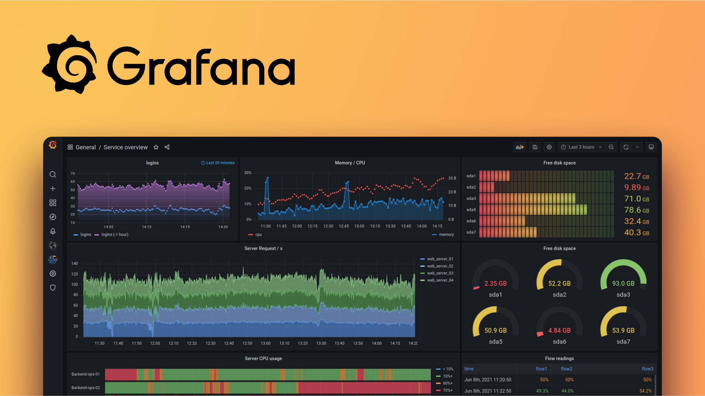

## Сервис для обработки логов и создания дашбордов

[Страница проекта](https://grafana.com/oss/loki/)

Сервис состоит из 3 компонентов:
- promtail: агент сбора логов
- loki: хранение логов
- grafana: отрисовка графиков/дашбордов

В папках loki-confgi, promtail-config лежат конфиги для этих компонентов, которые можно скачать на самом 
[сайте](https://grafana.com/docs/loki/latest/get-started/quick-start/), как и docker-compose файл

Существует несколько библиотек для интеграции с python. Они [предложены](https://grafana.com/docs/loki/latest/send-data/) 
grafana, но разработаны не ими:
- https://github.com/xente/loki-logger-handler
- https://github.com/RomanR-dev/python-logging-loki
- https://github.com/sourav-py/nextlog

### Старт сервиса
- создайте .env файл и заполните его
- docker compose up -d (должно появиться 3 контейнера)
- проверим, что работает loki - http://localhost:3100/ready
- проверим работу grafana - http://localhost:3000 (admin/admin)
- заходим в grafana и добавляем новый источник loki

